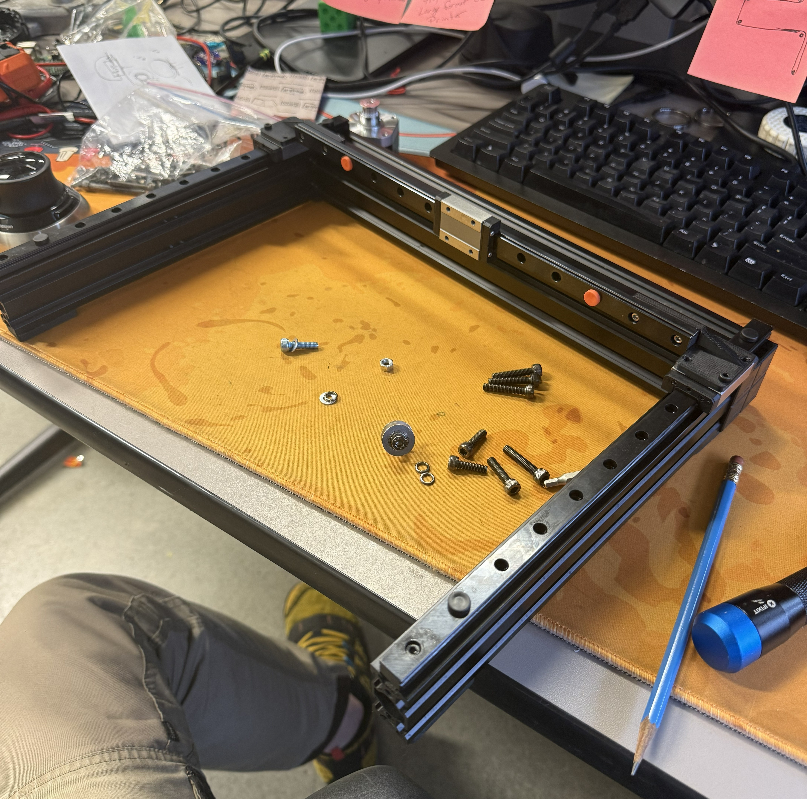
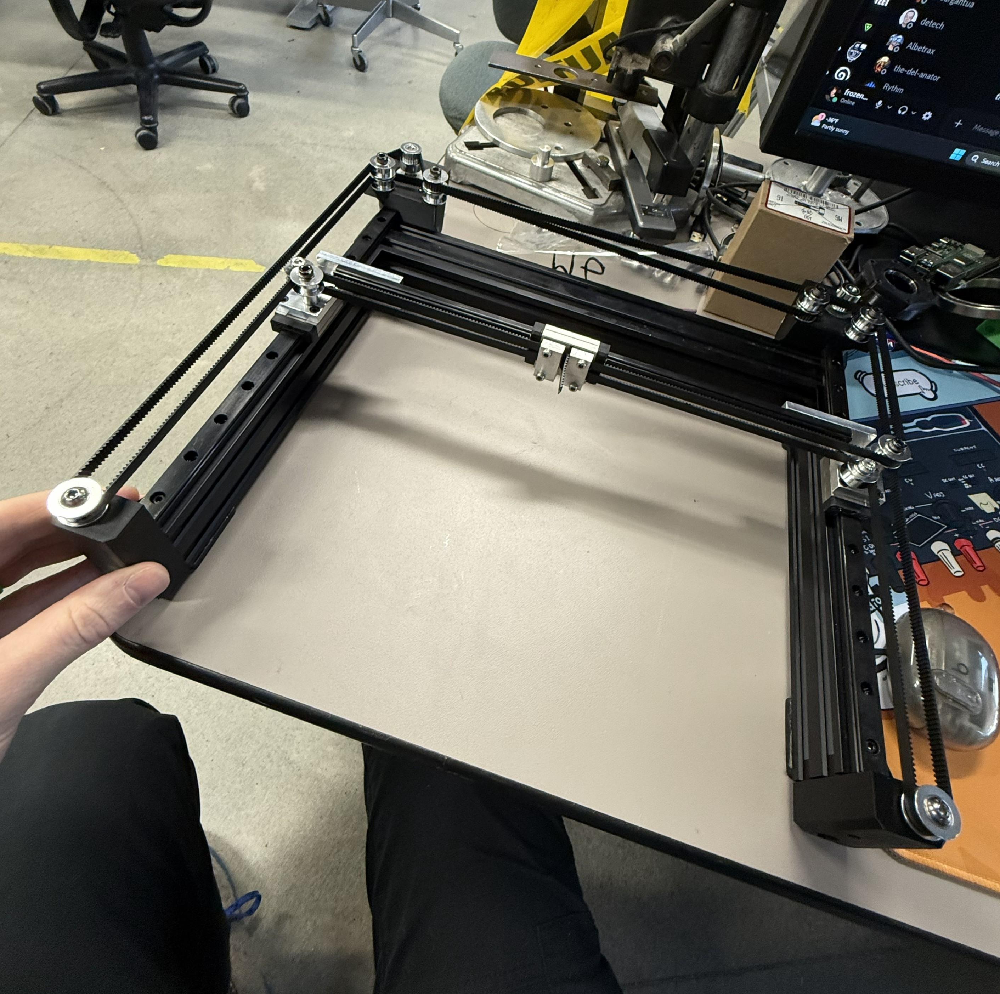
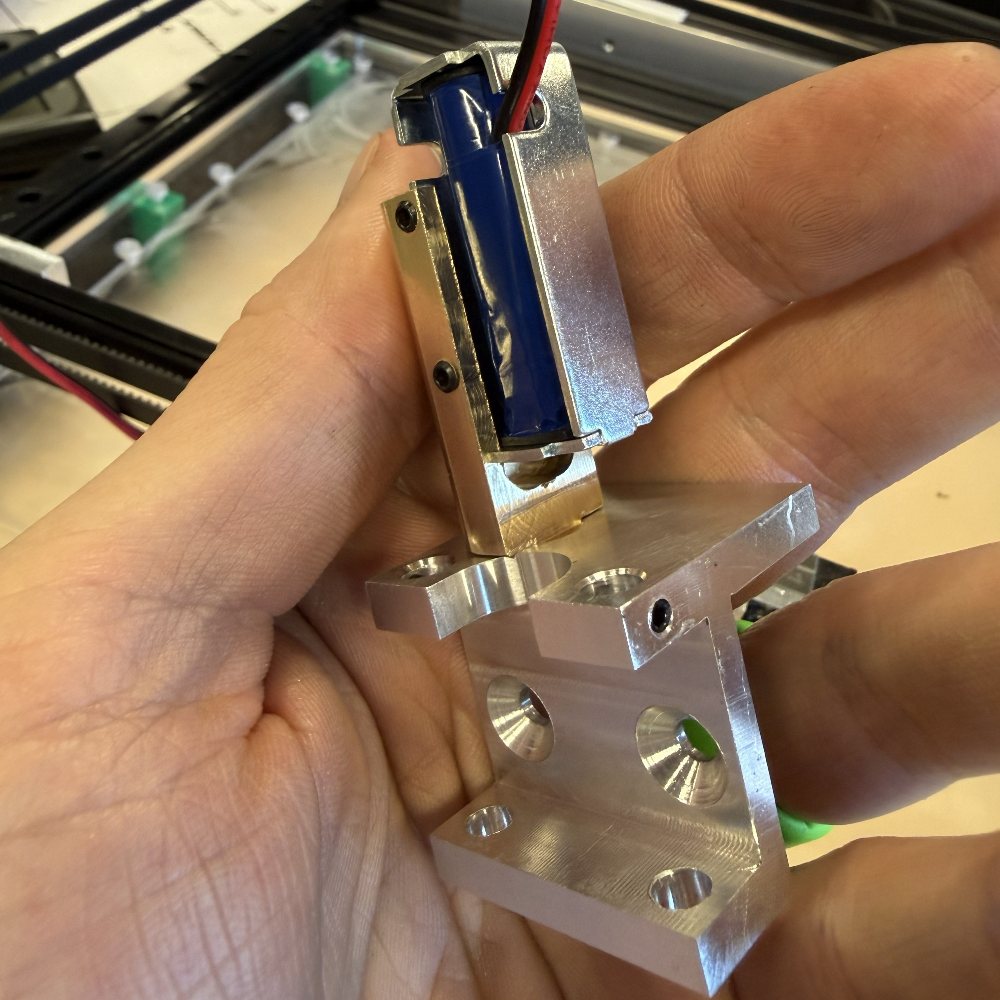
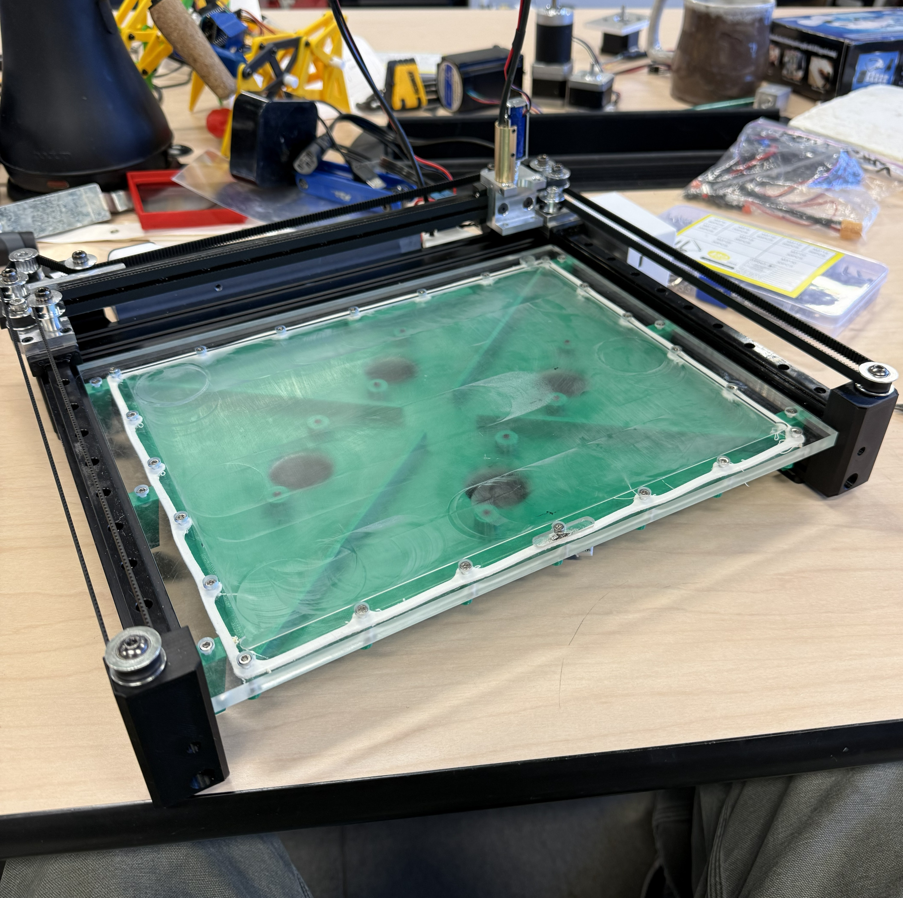
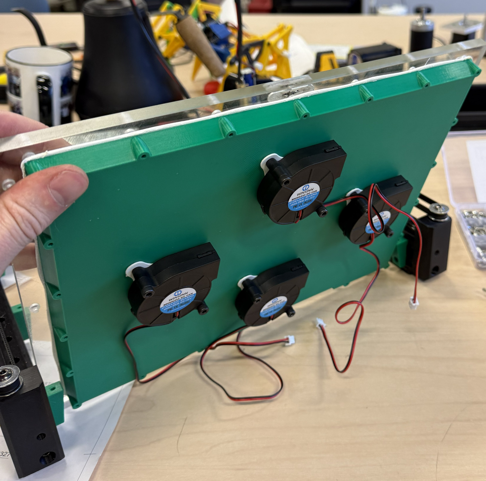

# 🖊️ PenPlotter

## TODO

- add args to run_printer.py

### Contents

- [Background](#background)
- [The Build](#the-build)
  - [Build Notes](#notes-on-replicating-the-build)
  - [Parts List](#parts-list)
- [Getting the code](#getting-the-code)
  - [Automatic Install](#automatic-install)
  - [Manual Install](#manual-install)
- [Using the Plotter](#using-the-plotter)

## Background

When CAD (Computer Aided Design) started to get more and more popular in the 1960's and 70's there became a need to be able to get high quality engineering accurate drawing out of the computers. While Inkjet printers were available at the time, the computer memory needed to turn a large vector based model into a rasterized image for printing on an inkjet printer was not available on most workstations of the time. Another disadvantage was the DPI (Dots Per Inch) or early Inkjets was only 75 to 100 while a pen plotter could get an equivalent of 1000 dpi. Pen plotters could also print in color, by either manually swapping the pens or, on later models, automatic color swapping. Color inkjet at the time was outrageously expensive.

While pen plotters are no longer used to plot designs because of the now comparable cost and much greater speed of inkjet and laser printers, they are an important part of engineering heritage. The point of this project was to build my own so that I could plot my own designs and projects that I am proud of in order to have permanent keepsakes from them.

## The Build

The main frame of the build was salvaged off an Anycubic Mega Zero 2.0 that I was done dealing with. Half way through taking it apart I came across the perfect frame to build my new pen plotter from. The stepper motors are also salvaged from that printer. Building the movement method as a CoreXY system seemed the most logical option as this would make the moving parts very lightweight and small as both of the needed steppers could be stationary on the rear of the frame. The CoreXY system also allowed for the easy inclusion of a belt tensioning system in the front belt pullies.

<p align="center">
  
  
  <br>
  <em>Left: Initial mockup with linear rails cut to size &nbsp;&nbsp; Right: Both belts added with stepper motors in place</em>
</p>

Another requirement that I set for myself was that i had to make a nice clacking noise while it was working. This was accomplished by using a magnetic solenoid to pull the pen up and down. One issue that can arise with these types of solenoids is that they easily get warm while they are working. To prevent this from being an issue the mount was machined out of brass and aluminum and the system was designed so that the solenoid was only on for the quick and short travel moves.

<p align="center">
  <br>
  <em>Machined magnetic solenoid mount</em>
</p>

The final issue that I had to address was the plotter sliding around. It was jerking a bit and this was causing the plot to get of because the paper was just attached to the table that it was sitting on that was not moving. A friend suggested that I make a vacuum table to fix this issue. The plate of the vacuum table is a thick piece of acrylic with 144 holes, each .089", drilled in to it in a regular pattern. The vacuum is provided by 4, 12 volt fans on the bottom of the chamber that extract air. I had been planning to make the fans also be controlled by via gcode but this seemed unneeded and I instead chose to make a simple switch on them that you manually turn on to print. 

<p align="center">
  
  
  <br>
  <em>Left: Vacuum Table top (pre-adding holes) &nbsp;&nbsp; Right: Vacuum table bottom</em>
</p>

### Notes on Replicating the build

In the assets folder you will find a Fusion file for the CAD models of this build as well as PDF drawings of important pieces and `.STEP` files. While I was building this I had access to a Prusa XL in order to print the parts for this. As such some of the vacuum chamber parts are a bit large to fit on the most common 3D printers. I also had access to an amazing machine shop that allowed me to make all the metal parts myself. The metal parts are designed to be machined without to much trouble so hopefully Send Cut Send wont charge too much. I will also include a rough parts list for the items I bought for the project and some major items I scavenged from the Mega Zero, but it will by no means be exhaustive.

***If you have any issues attempting to replicate this build please raise an issue on the [GitHub](https://github.com/madfrozen/penplotter/issues) and I will attempt to help however I can***

Important Notes:
 - When cutting down the 400mm Linear Rail, refer to the CAD model as the hole locations are important.
 - I got clone drv8825 stepper drivers from amazon, while I didn't have an issue there were some negative reviews. [Pololu](https://www.pololu.com/product/2133) sells the actual ones on their site and also has a great write up with how to use them (they are 5x the price though).
 - The power supply I used for the project is now out of stock the next one up is a different foot print then the one I used which might lead to some issues with the mounting plate for it and the 3D printed covers for it and the power switch.
 - The linear bearings listed are not of great quality. They worked better after adding more oil and running them up and down a 5mm rod, occasionally blowing them out with compressed air to remove any grit left from manufacturing.
 - All the bolts for the pullies are just m5 of different Lengths. All the m5 used in the project are Machine Thread
 - All other metric bolts are m3, the any that attach to the metal parts are machine thread (most are 8mm) and the ones that go into plastic are the self tapping kind.
 - The frame that I used was bolted together through the frame. To assemble the frame that you get you will have to purchase some sort of bracket to attach them together.
 - Most of the 3D printed parts can be printed without supports.
 - The gaskets for the vacuum system were printed out of foaming TPU but a low-infill regular TPU print should also work


### Parts List

<div style="display:flex; justify-content:center">

| Part | Quantity | Notes | Link |
|------|----------|-------|------|
| 2040 V-slot Al Extrusion | 2 | 240mm | NA |
| 4040 V-slot Al Extrusion | 1 | 360mm | NA |
| MGN12H Linear Rail | 1 | 280mm | [Amazon](https://amzn.to/435fnNw)
| MGN12H Linear Rail | 1 | 313mm | [Amazon](https://amzn.to/434sWgc)
| GT2 Toothless Pullies | 2 | CoreXY takes a lot of pullies | [Amazon](https://amzn.to/48SJriT)
| GT2 20 toothed pully (5mm bore) | 2 | Drive pullies | [Amazon](https://amzn.to/4wvaf2U)
| DRV8825 Stepper Drivers | 1 | Clone of [these](https://www.pololu.com/product/2133). | [Amazon](https://amzn.to/4eE2fWM)
| 12V 10A Power supply | 1 | The 12V 8A one I got is now out of stock | [Amazon](https://amzn.to/49HgKFO)
| MOSFET power switch | 1 | Used to switch the power into the magnetic solenoid | [Amazon](https://amzn.to/4u3qG4H)
| Magnetic Solenoid | 1 | it moves | [Amazon](https://amzn.to/4f1vbbB)
| 5mm Bore Linear Bearings | 1 | not great quality | [Amazon](https://amzn.to/42uyroo)
| 5mm Rod | 2 | 32mm | NA
| 5-40 Set Screws | 7 | Various lengths needed (see CAD) | NA
| 8-32 x $\frac{5}{16}$" flush mount bolts | 2 | This is a McMASTER-CARR listing, you might find them cheaper elsewhere | [McMASTER](https://www.mcmaster.com/91253A190/)
| 50mm Blower fans | 1 | they move air | [Amazon](https://amzn.to/4d7X3cF)
| Proto Boards for and Arduino Uno | 1 | work for the Uno Q too | [Amazon](https://amzn.to/4uaMVWC)
| T-slot nuts | 1 | nothing special | [Amazon](https://amzn.to/3PlJcGv)
| m4 x 25mm Machine bolts | 8 | To bolt the fans on | NA
| Power Switch | 1 | I got mine off my printer, but this looks identical | [Amazon](https://amzn.to/3R4mCmo)

</div>

## Getting The Code

Connect to your Arduino Uno Q and open a terminal in it, either through the Arduino App Lab interface or via ssh over the network.

`cd` into the `ArduinoApps` directory and clone this repo

```bash
cd ~/ArduinoApps/
git https://github.com/madfrozen/penplotter
```

### Automatic Install

To automatically install the needed files and packages simply run the `install.sh` file.

```bash
bash install.sh
```

Then after it completes

```bash
source ~/.bashrc
```

### Manual Install

Clone the Arduino-app-utils repo and install it with pip3  
You might need to `sudo apt install pip3`

```bash
git clone https://github.com/arduino/app-bricks-py.git ~/arduino-app-utils
cd ~/arduino-app-utils
sudo pip3 install . --break-system-packages
```

Add it to your path

```bash
echo 'export PATH="$HOME/.local/bin:$PATH"' >> ~/.bashrc
# This will add an alias so that you don't have to call python3 every time
echo "alias plot='python3 ~/ArduinoApps/penplotter/python/run_printer.py'" >> ~/.bashrc
source ~/.bashrc
```

You will also need to add `numpy` and `watchdog`.

```bash
sudo pip3 install numpy watchdog --break-system-packages
```

I know these the first two exist somewhere on the board but I haven't been able to find them yet, so for now we get an extra copy.

### Clone acmattons pdf/svg to gcode slicer

First cd into the new `penplotter` directory and clone the repo there

```bash
cd penplotter/
git clone https://github.com/acmattson3/svg-slicer
```

Then install the dependencies

```bash
sudo pip3 install svgelements shapely PyYAML matplotlib Pillow PyMuPDF Hershey-Fonts --break-system-packages
```

We drop the needed dependencies for the GUI as it will just be running headless. Feel free to also delete the `examples` folder.

### First time start up

Before you can use the plotter for the first time you will need to compile and flash the firmware

The first step is to install the needed libraries and board into the `arduino-cli`

```bash
arduino-cli core install arduino:zephyr
arduino-cli lib install Arduino_RouterBridge AccelStepper
```

Then you can run the upload script to compile then flash to the board

```bash
bash upload.sh
```

## Using the plotter

You will need to put the pdf file that you want to plot on to the board.

```bash
#example: run this on your computer, not the Arduino. In either Powershell or Bash
scp path_to_file/file.pdf arduino@[boardname].local:~/ArduinoApps/penplotter
```

This will put your file into the proper directory on your Uno Q.

To run the plotter make sure that you are in the `penplotter` directory and run:

```bash
plot [name of file here] [any args here]
```

You will see a print out of what the slicer is doing and a rolling percentage complete of the plot job.
